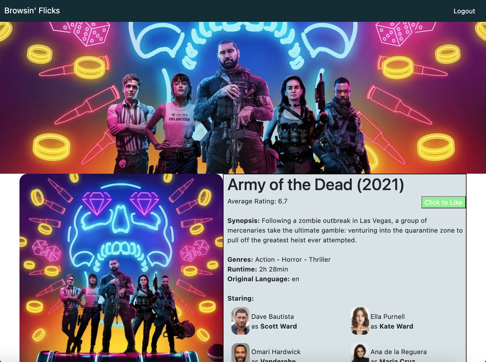

# Browsin Flicks (Full Stack)

A full stack applicaion to browse through movies by filters. Inspired by my unability to find a good movie to watch based on what I was in the mood for.

### Application "home" screenshot:

### Screenshot of the "show" page:

### Screenshot of application viewed in a narrow window (similar to iPhone):

## Summary

- The application can browse through movies based on the rating, year, genre, and how well known it is.
- As a movie buff, these four filters are what I have found to be the most important in order to find a movie that suits what you are looking for.
- The application fetches data from The Movie Database API based on the filters.
- Movies are presented and clickable.
- After clicking a movie, the "show" page opens, which presents information about the movie, including what streaming services the movie is on.
- The application also includes user authentication with appropriate hashes/salt for the password.
- When signed in, a user can "like" a movie.
- A movie recommendation page based on the user's "likes" is coming soon

## Reflection

- This application was my first large full stack project.
- Being my one of my first full applications, it was definitely a great practice application to work with MongoDB, APIs, authentication, etc.

## Application Inspiration

- When browsing for movies on other websites, there is no "how well known is this movie" selector. Since other websites don't have this option, when searching for the best movies of one genre and timeframe (e.g. 2014-2018, horror movies), the websites present movies with excellent ratings that virtually no one has ever heard before. While still potentially good movies, I want the ability to set a minimum threshold of how many people actually know of the movie; otherwise, you are returned with movies with perfect ratings but only a small handful of reviews.
